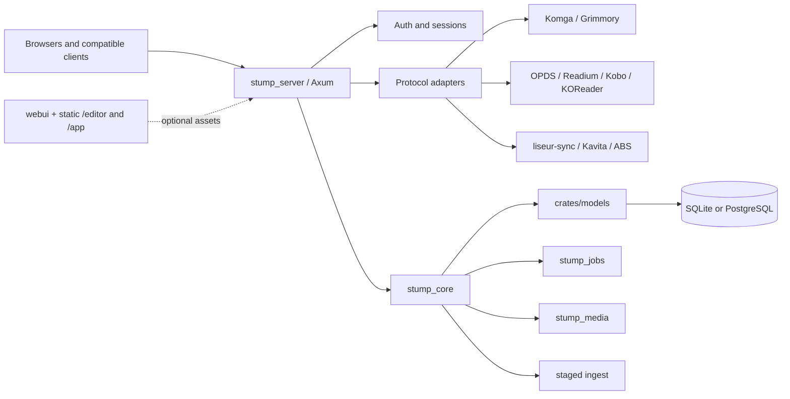
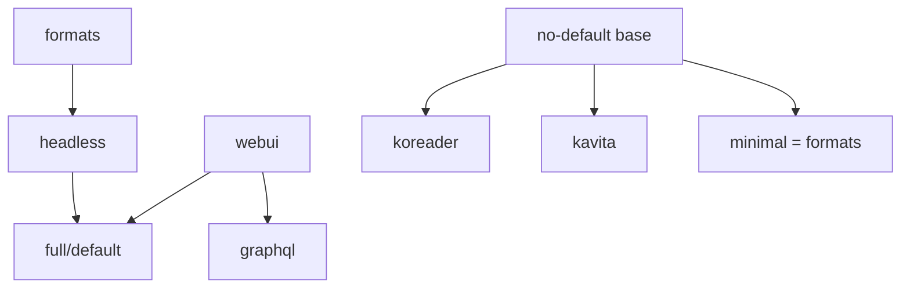

<p align="center">
  
  <br />
  <a href="./LICENSE">
    
  </a>
</p>

# Coppice

Coppice is the product-facing name of this fork of the open-source
[Stump](https://github.com/stumpapp/stump) media server. It is a self-hosted
library for your own ebooks, comics, manga, and audiobooks. The fork keeps the
upstream wire contracts and technical names where clients or distributions
require them, while making the server easier to run as a headless, modular
service.

This repository is not a media search or download service. It hosts and serves
media that you already own or are otherwise allowed to store.

## Start here

- **Human wiki:** [Coppice documentation](docs/content/docs/index.mdx)
- **Reader devices:** [manage device clients in the Home app](docs/content/docs/guides/features/devices.mdx)
- **Install and run:** [installation guide](docs/content/docs/getting-started/installation/index.mdx)
- **Compatibility at a glance:** [integration and compatibility status](docs/content/docs/guides/integrations/compatibility.mdx)
- **Modular deployments:** [server profiles and static apps](docs/content/docs/guides/configuration/modular-deployment.mdx)
- **Request and acquisition boundary:** [request and acquisition guide](docs/content/docs/guides/integrations/acquisition.mdx)
- **Developer source of truth:** [server architecture](docs/content/docs/developer/server-architecture.mdx), [client verification](docs/content/docs/developer/client-verification.mdx), and [current state](docs/content/docs/developer/state.mdx)

The Fumadocs site under `docs/` is the human-facing wiki. The developer pages
linked above contain the detailed route, feature, and evidence records; user
pages link to them rather than making broader compatibility promises.

## What is current

- The `stump_server` binary runs one Rust process with one database, shared
  authentication, and lazy lifecycle components. Cargo features compile only
  the protocol or processing surfaces a deployment needs.
- The default `full` profile includes the headless backend and the `webui`
  GraphQL web-facing surfaces; `headless` keeps backend protocols without
  those surfaces.
- Shipped protocol surfaces include OPDS 1.2/PSE and 2.0, Komga, Kobo,
  KOReader, liseur-sync, Kavita, and Audiobookshelf-compatible REST. The ABS
  Engine.IO/Socket.IO lane is present; broader official-app verification is
  still pending.
- The request ledger and Home UI retain metadata-backed creation, per-user
  visibility, manager approval/rejection, notifications, and social
  recommendation handoff. Managers can use the separate MAM Bridge sidecar
  for confirmed acquisition of approved requests; see the
  [acquisition boundary](docs/content/docs/guides/integrations/acquisition).
- Read-aloud pairing, validated `SyncMapV1` import, alignment enqueue, and
  authenticated cache-only status/download are implemented. Optional
  operator-configured Storyteller and native CTC worker runners are available;
  they are not bundled or server-local ML. Full synchronized playback and
  device verification remain open; see the [read-aloud contract](docs/content/docs/developer/read-aloud.mdx).
- Staged ingest, identifier matching, ordinary EPUB playback, and ordinary
  audiobook playback remain separate capabilities. Hardcover metadata mapping
  is covered by offline fixtures; no live credential run is recorded.
- Compatibility evidence is deliberately scoped to each client and protocol;
  physical-device and replay results live in the [client verification
  matrix](docs/content/docs/developer/client-verification.mdx).

## Evidence-labelled compatibility

An implemented protocol profile does not certify every client. The canonical
matrix records each pinned client version, evidence tier, exercised flow, and
remaining limit: [client verification](docs/content/docs/developer/client-verification.mdx).
Hardware-specific constraints are in [platform status](docs/content/docs/developer/platforms.mdx).

## Request, acquisition, and alignment boundaries

Coppice owns Universal-style metadata search plus its request ledger,
permissions, visibility rules, approval/rejection decisions, notifications,
and social recommendation handoff. A manager with `ACQUIRE_RELEASES` can
search and explicitly confirm a MAM Bridge grab for an approved request.
Completed downloads are copied into staged ingest for Editor review; approval
fulfils the request and notifies its requester. MAM credentials and torrent
transport stay in the separate authenticated sidecar; Coppice has no
in-process downloader, automatic retries, or auto-grab. See the
[acquisition boundary](docs/content/docs/guides/integrations/acquisition).

Read-aloud timing import, validated maps, alignment enqueue, and cache-only
status/download are shipped. Operators may configure external Storyteller or
native CTC worker runners; neither is bundled or run as server-local ML.
Readiness quality checks and full synchronized EPUB/audio playback remain
open. See the [read-aloud implementation and boundaries](docs/content/docs/developer/read-aloud.mdx).

## Modular server profiles

Cargo features determine what is compiled; environment/configuration switches
determine which compiled routes are mounted. Both gates are required for
optional protocol adapters.

| Profile         | Exact command                                                                                                      | Compiled scope                                                                                                  |
| --------------- | ------------------------------------------------------------------------------------------------------------------ | --------------------------------------------------------------------------------------------------------------- |
| No-default base | `cargo run -p stump_server --bin stump_server --no-default-features`                                               | Leanest server composition: core REST/auth/database without the `formats` bundle.                               |
| Minimal         | `cargo run -p stump_server --bin stump_server --no-default-features --features minimal`                            | `minimal = ["formats"]`; adds the PDF/RAR/transform format bundle while keeping optional protocol adapters out. |
| KOReader-only   | `ENABLE_KOREADER_SYNC=true cargo run -p stump_server --bin stump_server --no-default-features --features koreader` | Compiles only the KOReader adapter among protocol leaves; `ENABLE_KOREADER_SYNC=true` mounts it.                |
| Kavita-only     | `STUMP_ENABLE_KAVITA=true cargo run -p stump_server --bin stump_server --no-default-features --features kavita`    | Compiles only the Kavita adapter among protocol leaves; `STUMP_ENABLE_KAVITA=true` mounts it.                   |
| Headless        | `cargo run -p stump_server --bin stump_server --no-default-features --features headless` | All backend protocol and processing features without the `webui` GraphQL web-facing surfaces. |
| Full/default    | `cargo run -p stump_server --bin stump_server`                                                                     | `default = ["full"]`; `full = ["headless", "webui"]`.                                                           |

The public `webui` feature implies `graphql`, including the `graphql/web`
resolver surface. It does not bundle or serve a frontend. Home (`/app`) and
Editor (`/editor`) are separate static applications, configured independently
with `STUMP_HOME_APP_DIR` and `INGEST_EDITOR_DIR`; each directory must contain
the app's `index.html`. They can be served by a headless binary. The full Docker
target builds and includes both applications; the headless target includes
neither:

```sh
docker buildx build -f docker/Dockerfile --target full .
docker buildx build -f docker/Dockerfile --target headless .
```

See [modular deployment](docs/content/docs/guides/configuration/modular-deployment.mdx) for the full switch table.

### Useful runtime switches

| Environment key                | Purpose                                                                    |
| ------------------------------ | -------------------------------------------------------------------------- |
| `STUMP_ENABLE_WEBUI`           | Enables GraphQL web-facing surfaces when compiled with `webui`.             |
| `STUMP_ENABLE_BACKGROUND_JOBS` | Enables scheduled jobs, watcher, and the configured executor.              |
| `ENABLE_KOBO_SYNC`             | Mounts Kobo routes when the `kobo` feature is compiled.                    |
| `ENABLE_KOREADER_SYNC`         | Mounts KOReader routes when the `koreader` feature is compiled.            |
| `STUMP_ENABLE_KAVITA`          | Mounts Kavita routes when the `kavita` feature is compiled.                |
| `STUMP_ENABLE_KOMGA`           | Mounts Komga routes when the `komga` feature is compiled.                  |
| `STUMP_ENABLE_ABS`             | Mounts Audiobookshelf-compatible routes when `abs` is compiled.            |
| `ENABLE_OPDS_PROGRESSION`      | Enables OPDS progression writes where supported.                           |
| `INGEST_EDITOR_DIR`            | Serves the ingest editor at `/editor` when the directory has `index.html`. |
| `STUMP_HOME_APP_DIR`           | Serves the Home app at `/app` when the directory has `index.html`.         |

## Architecture at a glance



The feature graph is intentionally modular rather than a promise that every
client is supported:



## Crate map

| Crate                                  | Responsibility                                                                                                        |
| -------------------------------------- | --------------------------------------------------------------------------------------------------------------------- |
| `core` (`stump_core`)                  | Configuration, lifecycle, filesystem orchestration, jobs, and core API behavior.                                      |
| `crates/models`                        | Entities, domain types, and persistence-facing services.                                                              |
| `crates/media` (`stump_media`)         | EPUB/ZIP/PDF/RAR processing when the corresponding features are compiled, hashing, Readium manifests, and thumbnails. |
| `crates/scanner` (`stump_scanner`)     | Library scanning and shared directory-mtime snapshots.                                                                |
| `crates/watcher`                       | File-watcher implementation and adapters.                                                                             |
| `crates/jobs` (`stump_jobs`)           | Queue lifecycle, inline or Apalis execution, cancellation, counters, and scheduling.                                  |
| `crates/komga` (`stump_komga`)         | Komga DTOs, pagination, and error mapping.                                                                            |
| `crates/kobo` (`stump_kobo`)           | Kobo backend contracts.                                                                                               |
| `crates/kepub` (`stump_kepub`)         | KEPUB conversion.                                                                                                     |
| `crates/koreader` (`stump_koreader`)   | KOReader sync backend and hash contracts.                                                                             |
| `crates/opds` (`stump_opds`)           | OPDS 1.2/2.0 backend contracts.                                                                                       |
| `crates/liseur-sync`                   | Native liseur-sync provider contracts.                                                                                |
| `crates/auth` (`stump_auth`)           | Authenticated user/session context and authorization errors.                                                          |
| `crates/api-types` (`stump_api_types`) | Transport-neutral request-origin and pagination types.                                                                |
| `crates/graphql`                       | GraphQL schema and resolver errors.                                                                                   |

Scanner implementation is owned by `crates/scanner` and watcher implementation
by `crates/watcher`; the removed upstream `core/src/scan` duplicates are not
part of the architecture.

## Project documentation

For implementation boundaries and compatibility evidence, use the
[developer documentation](docs/content/docs/developer/state.mdx), the
[client verification matrix](docs/content/docs/developer/client-verification.mdx),
and the [roadmap](docs/content/docs/developer/roadmap.mdx). For installation
and day-to-day configuration, use the [human wiki](docs/content/docs/index.mdx).

## Upstream relationship and licenses

Coppice is derived from the open-source [Stump project](https://github.com/stumpapp/stump).
Stump compatibility names remain where they are part of a technical API,
package, binary, environment key, storage field, or attribution; those names
are not a second product brand. Coppice is independently maintained and is
not reviewed or endorsed by the upstream project.

See the [Coppice contribution guide](docs/content/docs/developer/contributing.mdx)
for this repository's contribution process.

The repository is licensed under the MIT License. Copyright (c) 2022 Aaron
Leopold and (c) 2026 Coppice contributors; see [LICENSE](LICENSE).
