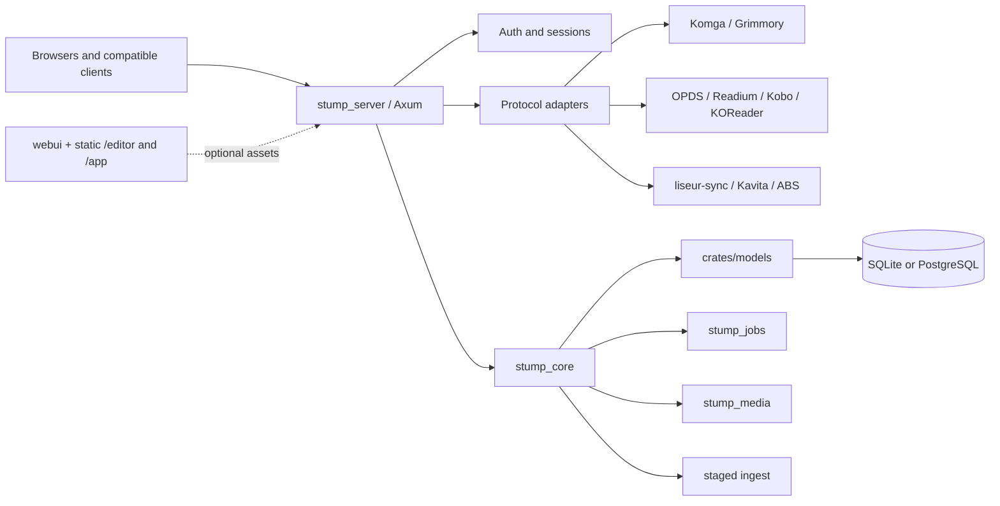
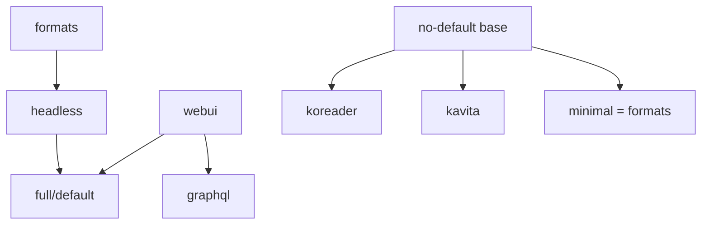

<p align="center">
  
  <br />
  <a href="./LICENSE">
    
  </a>
</p>

# Coppice

Coppice is the product-facing name of this fork of the open-source
[Stump](https://github.com/stumpapp/stump) media server. It is a self-hosted
library for your own ebooks, comics, manga, and audiobooks. The fork keeps the
upstream wire contracts and technical names where clients or distributions
require them, while making the server easier to run as a headless, modular
service.

This repository is not a media search or download service. It hosts and serves
media that you already own or are otherwise allowed to store.

## Start here

- **Human wiki:** [Coppice documentation](docs/content/docs/index.mdx)
- **Reader devices:** [manage device clients in the Home app](docs/content/docs/guides/features/devices.mdx)
- **Install and run:** [installation guide](docs/content/docs/getting-started/installation/index.mdx)
- **Compatibility at a glance:** [integration and compatibility status](docs/content/docs/guides/integrations/compatibility.mdx)
- **Modular deployments:** [server profiles and static apps](docs/content/docs/guides/configuration/modular-deployment.mdx)
- **Request and acquisition boundary:** [request and acquisition guide](docs/content/docs/guides/integrations/acquisition.mdx)
- **Developer source of truth:** [server architecture](docs/content/docs/developer/server-architecture.mdx), [client verification](docs/content/docs/developer/client-verification.mdx), and [current state](docs/content/docs/developer/state.mdx)

The Fumadocs site under `docs/` is the human-facing wiki. The developer pages
linked above contain the detailed route, feature, and evidence records; user
pages link to them rather than making broader compatibility promises.

## What is current

- The `stump_server` binary runs one Rust process with one database, shared
  authentication, and lazy lifecycle components. Cargo features compile only
  the protocol or processing surfaces a deployment needs.
- The default `full` profile includes the headless backend and web UI;
  `headless` keeps backend protocols without the SPA module or frontend assets.
- Shipped protocol surfaces include OPDS 1.2/PSE and 2.0, Komga, Kobo,
  KOReader, liseur-sync, Kavita, and Audiobookshelf-compatible REST. The ABS
  Engine.IO/Socket.IO lane is present; broader official-app verification is
  still pending.
- The request ledger and Home UI retain metadata-backed creation, per-user
  visibility, manager approval/rejection, notifications, and social
  recommendation handoff. MAM acquisition is deferred; Coppice ships no active
  acquisition connector.
- Read-aloud pairing, validated `SyncMapV1` import, alignment enqueue, and
  authenticated cache-only status/download are present. Storyteller/SMIL
  execution and synchronized read-aloud playback remain planned.
- Staged ingest, identifier matching, ordinary EPUB playback, and ordinary
  audiobook playback remain separate capabilities. Hardcover metadata mapping
  is covered by offline fixtures; no live credential run is recorded.
- This worktree is an uncommitted, fully gated nightly integration. The
  2026-09-21 Rust, Bun, browser, and 341-request protocol gates passed. See
  [.omp/PROJECT_STATE.md](.omp/PROJECT_STATE.md) for the exact evidence,
  commands, and exclusions.

## Evidence-labelled compatibility

The evidence labels are deliberately narrow:

- **Shipped** means the implementation is present in this fork.
- **Contract-tested** means a pinned protocol fixture, replay, or server
  harness exercised the surface. It does not prove that a physical app works.
- **Device-tested** means a real app or device ran the flow against the server.
- **Source-only** means pinned client or protocol source was inspected without a
  live run.
- **Planned** means the capability is a future design or implementation item.
- **Blocked** means a missing prerequisite currently prevents the claimed flow;
  it is not a promise that the feature works.

The current matrix is intentionally scoped to observed evidence:

| Surface or client                                                  | Implementation | Evidence                                             | Boundary                                                                                                                                                                           |
| ------------------------------------------------------------------ | -------------- | ---------------------------------------------------- | ---------------------------------------------------------------------------------------------------------------------------------------------------------------------------------- |
| Komga profile / Komelia 0.19.0                                     | Shipped        | Device-tested; Contract-tested                       | Login, browse, CBZ/EPUB offline download, reading progress, and mark-read were exercised. This is a compatibility profile, not full Komga parity.                                  |
| Grimmory `/komga` alias                                            | Shipped        | Device-tested; Contract-tested                       | Device login was exercised; listing, file, and thumbnail routes were replayed.                                                                                                     |
| Mihon Komga extension/tracker                                      | Shipped        | Device-tested                                        | Browse, download, read, and tracker GET/PUT were exercised.                                                                                                                        |
| Kavita profile: Turnleaf and Kamigura                              | Shipped        | Device-tested; Contract-tested                       | Browse/read/download and the recorded Kavita flows were exercised; the wire profile also has a replay.                                                                             |
| Other Kavita-shaped clients (Inkita, Kover, Kamare, Mihon tracker) | Shipped        | Source-only                                          | Their pinned sources informed the profile; no device run is claimed.                                                                                                               |
| OPDS 1.2/PSE                                                       | Shipped        | Device-tested; Contract-tested                       | Liseur exercised OPDS 1.2; generic OPDS clients are not blanket-certified.                                                                                                         |
| OPDS 2.0                                                           | Shipped        | Contract-tested                                      | Auth and progression contracts are covered; a universal OPDS 2.0 app claim is not made.                                                                                            |
| Kobo sync and KEPUB                                                | Shipped        | Contract-tested; Blocked                             | Initialization, sync, range requests, KEPUB, and reading-state routes are replayed. No physical Kobo has run against Coppice.                                                      |
| KOReader/KOSync                                                    | Shipped        | Contract-tested; Device-tested; Source-only; Blocked | Server routes are probed; Liseur's KOReader-sync flow is device-tested. The native KOReader app and `coppice.koplugin` have not been loaded; the plugin remains source-only.       |
| liseur-sync                                                        | Shipped        | Device-tested; Contract-tested; Source-only          | Positions, heads, and annotations were exercised through Liseur. The attachment side-object extension is implemented, but no pinned-client or device attachment claim is made.     |
| Audiobookshelf-compatible REST / Lissen 1.11.22                    | Shipped        | Device-tested; Contract-tested; Planned              | Lissen browse, listen, range download, sessions, and bookmarks were exercised. The Engine.IO/Socket.IO lane is present; a broader official Audiobookshelf-app run remains pending. |
| Request ledger and approval UI                                    | Shipped        | Source-only                                          | Metadata-backed requests, per-user visibility, manager decisions, notifications, and social handoff are present. Acquisition is deferred; no MAM gateway or downloader ships.     |
| Ordinary EPUB playback                                             | Shipped        | Device-tested                                        | EPUB reading is an ordinary reading flow, separate from audiobook synchronization.                                                                                                 |
| Ordinary audiobook playback                                        | Shipped        | Device-tested                                        | Audiobook playback is an ordinary audio flow, separate from EPUB reading and read-aloud alignment.                                                                                 |
| Hardcover metadata                                                 | Shipped        | Contract-tested; Blocked                             | Offline payload fixtures and mapper tests exist; live credentials have not been verified.                                                                                          |
| Hardcover account/progress/journal sync                            | Planned        | Planned; Blocked                                     | No account, progress, or journal sync is shipped; live credentials and the sync design remain prerequisites.                                                                       |
| Read-aloud pairing, SyncMap, and cache delivery                    | Shipped        | Source-only; Planned                                 | Pairing, validated map import, alignment enqueue, and authenticated cache-only status/download passed the current integration gate; worker execution and synchronized playback remain planned.                                                     |
| Synchronized Storyteller read-aloud EPUB                           | Planned        | Source-only; Planned; Blocked                        | Storyteller/SMIL execution and synchronized read-aloud playback remain planned.                                                                                                    |

Canonical evidence and caveats live in [client verification](docs/content/docs/developer/client-verification.mdx), [platform status](docs/content/docs/developer/platforms.mdx), [Kobo capabilities](docs/content/docs/developer/kobo-sync-capabilities.mdx), [KOReader profile](docs/content/docs/developer/koreader-plugin.mdx), [Audiobookshelf profile](docs/content/docs/developer/abs-compat.mdx), and [read-aloud status](docs/content/docs/developer/read-aloud.mdx).

## Request, acquisition, and alignment boundaries

Coppice owns Universal-style metadata search plus its request ledger,
permissions, visibility rules, approval/rejection decisions, notifications,
and social recommendation handoff. An approved request records a decision; it
does not acquire a file.

MAM acquisition is deferred. Any future acquisition integration belongs in a
separate authenticated provider sidecar, outside the Coppice process and
request GraphQL contract. This is a boundary, not a promise that a connector is
implemented.

The current flow ends at approval:

```text
metadata search or recommendation
  -> request
  -> permission and visibility checks
  -> operator approval or rejection
```

An alignment request is a separate flow and requires a confirmed EPUB/audio
pair. It may then use the existing timing import, a future Storyteller worker,
and finally the native CTC fallback candidate:

```text
confirmed EPUB + audiobook pair
  -> existing timing import
  -> Storyteller worker (future)
  -> native CTC fallback (future)
```

Storyteller is never a search or catalog provider and is not a bundled
runtime dependency. Ordinary EPUB and ordinary audiobook playback remain
independent even if alignment work is added later.

## Modular server profiles

Cargo features determine what is compiled; environment/configuration switches
determine which compiled routes are mounted. Both gates are required for
optional protocol adapters.

| Profile         | Exact command                                                                                                      | Compiled scope                                                                                                  |
| --------------- | ------------------------------------------------------------------------------------------------------------------ | --------------------------------------------------------------------------------------------------------------- |
| No-default base | `cargo run -p stump_server --bin stump_server --no-default-features`                                               | Leanest server composition: core REST/auth/database without the `formats` bundle.                               |
| Minimal         | `cargo run -p stump_server --bin stump_server --no-default-features --features minimal`                            | `minimal = ["formats"]`; adds the PDF/RAR/transform format bundle while keeping optional protocol adapters out. |
| KOReader-only   | `ENABLE_KOREADER_SYNC=true cargo run -p stump_server --bin stump_server --no-default-features --features koreader` | Compiles only the KOReader adapter among protocol leaves; `ENABLE_KOREADER_SYNC=true` mounts it.                |
| Kavita-only     | `STUMP_ENABLE_KAVITA=true cargo run -p stump_server --bin stump_server --no-default-features --features kavita`    | Compiles only the Kavita adapter among protocol leaves; `STUMP_ENABLE_KAVITA=true` mounts it.                   |
| Headless        | `cargo run -p stump_server --bin stump_server --no-default-features --features headless`                           | All backend protocol and processing features, without the SPA/web UI.                                           |
| Full/default    | `cargo run -p stump_server --bin stump_server`                                                                     | `default = ["full"]`; `full = ["headless", "webui"]`.                                                           |

The `webui` feature now implies `graphql` (including the `graphql/web`
resolver surface), so a web UI build cannot silently omit GraphQL. The
`STUMP_ENABLE_WEBUI` runtime switch still controls whether the compiled SPA is
mounted. The full Docker target copies frontend output to
`STUMP_CLIENT_DIR`; the headless target does not copy SPA assets:

```sh
docker buildx build -f docker/Dockerfile --target full .
docker buildx build -f docker/Dockerfile --target headless .
```

The `/editor` and `/app` static applications are separate runtime mounts, not
Cargo features. Set `INGEST_EDITOR_DIR` and/or `STUMP_HOME_APP_DIR` to built
directories containing `index.html`; they can be served by a headless binary
without enabling `webui`. See [modular deployment](docs/content/docs/guides/configuration/modular-deployment.mdx) for the full switch table.

### Useful runtime switches

| Environment key                | Purpose                                                                    |
| ------------------------------ | -------------------------------------------------------------------------- |
| `STUMP_ENABLE_WEBUI`           | Mounts the compiled SPA; ineffective in a build without `webui`.           |
| `STUMP_CLIENT_DIR`             | Directory containing the web bundle served by the web UI.                  |
| `STUMP_ENABLE_BACKGROUND_JOBS` | Enables scheduled jobs, watcher, and the configured executor.              |
| `ENABLE_KOBO_SYNC`             | Mounts Kobo routes when the `kobo` feature is compiled.                    |
| `ENABLE_KOREADER_SYNC`         | Mounts KOReader routes when the `koreader` feature is compiled.            |
| `STUMP_ENABLE_KAVITA`          | Mounts Kavita routes when the `kavita` feature is compiled.                |
| `STUMP_ENABLE_KOMGA`           | Mounts Komga routes when the `komga` feature is compiled.                  |
| `STUMP_ENABLE_ABS`             | Mounts Audiobookshelf-compatible routes when `abs` is compiled.            |
| `ENABLE_OPDS_PROGRESSION`      | Enables OPDS progression writes where supported.                           |
| `INGEST_EDITOR_DIR`            | Serves the ingest editor at `/editor` when the directory has `index.html`. |
| `STUMP_HOME_APP_DIR`           | Serves the Home app at `/app` when the directory has `index.html`.         |

## Architecture at a glance



The feature graph is intentionally modular rather than a promise that every
client is supported:



## Crate map

| Crate                                  | Responsibility                                                                                                        |
| -------------------------------------- | --------------------------------------------------------------------------------------------------------------------- |
| `core` (`stump_core`)                  | Configuration, lifecycle, filesystem orchestration, jobs, and core API behavior.                                      |
| `crates/models`                        | Entities, domain types, and persistence-facing services.                                                              |
| `crates/media` (`stump_media`)         | EPUB/ZIP/PDF/RAR processing when the corresponding features are compiled, hashing, Readium manifests, and thumbnails. |
| `crates/scanner` (`stump_scanner`)     | Library scanning and shared directory-mtime snapshots.                                                                |
| `crates/watcher`                       | File-watcher implementation and adapters.                                                                             |
| `crates/jobs` (`stump_jobs`)           | Queue lifecycle, inline or Apalis execution, cancellation, counters, and scheduling.                                  |
| `crates/komga` (`stump_komga`)         | Komga DTOs, pagination, and error mapping.                                                                            |
| `crates/kobo` (`stump_kobo`)           | Kobo backend contracts.                                                                                               |
| `crates/kepub` (`stump_kepub`)         | KEPUB conversion.                                                                                                     |
| `crates/koreader` (`stump_koreader`)   | KOReader sync backend and hash contracts.                                                                             |
| `crates/opds` (`stump_opds`)           | OPDS 1.2/2.0 backend contracts.                                                                                       |
| `crates/liseur-sync`                   | Native liseur-sync provider contracts.                                                                                |
| `crates/auth` (`stump_auth`)           | Authenticated user/session context and authorization errors.                                                          |
| `crates/api-types` (`stump_api_types`) | Transport-neutral request-origin and pagination types.                                                                |
| `crates/graphql`                       | GraphQL schema and resolver errors.                                                                                   |

Scanner implementation is owned by `crates/scanner` and watcher implementation
by `crates/watcher`; the removed upstream `core/src/scan` duplicates are not
part of the architecture.

## Project state and roadmap

- [Project state](.omp/PROJECT_STATE.md) — branch, source map, and current coordination state.
- [Next steps](.omp/NEXT_STEPS.md) — the working roadmap.
- [Roadmap docs](docs/content/docs/developer/) — including proposed (not implemented) work in [Server architecture](docs/content/docs/developer/server-architecture.mdx) and [Modular ingest](docs/content/docs/developer/modular-ingest.mdx).

- **Current:** default/full compatibility plus the metadata-backed request
  ledger/approval UI and read-aloud backend.
- **Planned:** complete Storyteller/SMIL alignment and synchronized EPUB
  playback after a confirmed pair.
- **Blocked:** live Hardcover account/progress/journal sync and physical-device
  claims without evidence.

For implementation details and evidence, use the [developer wiki](docs/content/docs/developer/state.mdx) and the [roadmap](docs/content/docs/developer/roadmap.mdx). For installation and day-to-day configuration, use the [human wiki](docs/content/docs/index.mdx).

## Upstream relationship and licenses

This repository is a fork of [stumpapp/stump](https://github.com/stumpapp/stump), tracking the nightly branch. Coppice follows the upstream repository for shared protocol, client, and distribution contracts. Changes here are made to be narrowly scoped and upstreamable, but they are not reviewed or endorsed by upstream. For the upstream project, its documentation, and its installation guides, see [stumpapp.dev](https://www.stumpapp.dev).

For the issue-first upstream contribution policy, fresh `origin/nightly`
branches, narrow changes, and LLM disclosure rules, see the
[developer contribution guide](docs/content/docs/developer/contributing.mdx).
The integration branch is never a PR source.

Upstream names remain where they are part of a technical API, package, binary, environment key, storage field, Docker image slug, or attribution; those names are not a second product brand.

The repository root is MIT, as shown by [LICENSE](LICENSE). The nested Expo application retains its upstream GPL-3.0 license and should be treated as a separate distribution boundary: [apps/expo/LICENSE](apps/expo/LICENSE). Some assets and native modules also retain their upstream notices; see the relevant source files and the [attribution notes](docs/content/docs/developer/contributing.mdx).

## Attribution

This fork inherits the upstream Stump project and the work of its contributors:

- Some of the icons used in the web and mobile applications are from the [Spacedrive](https://github.com/spacedriveapp/spacedrive/tree/main/packages/assets/icons) repository, and are licensed under the [FSL-1.1-ALv2](https://github.com/spacedriveapp/spacedrive/blob/main/LICENSE) license.
- The native Readium expo modules were adapted from [Storyteller](https://gitlab.com/storyteller-platform/storyteller).
- The [expo application](./apps/expo/LICENSE) is licensed under [GPL-3.0](./apps/expo/LICENSE) ([summary](https://www.gnu.org/licenses/gpl-3.0.html)).
- The [`wifi-ssid` native module](./apps/expo/modules/wifi-ssid) was sourced from Streamyfin and licensed under [MPL-2.0](https://www.mozilla.org/en-US/MPL/2.0/) ([summary](https://www.tldrlegal.com/license/mozilla-public-license-2-0-mpl-2)).
- All other code in the repository is licensed under [MIT License](./LICENSE) ([summary](https://www.tldrlegal.com/license/mit-license)).
